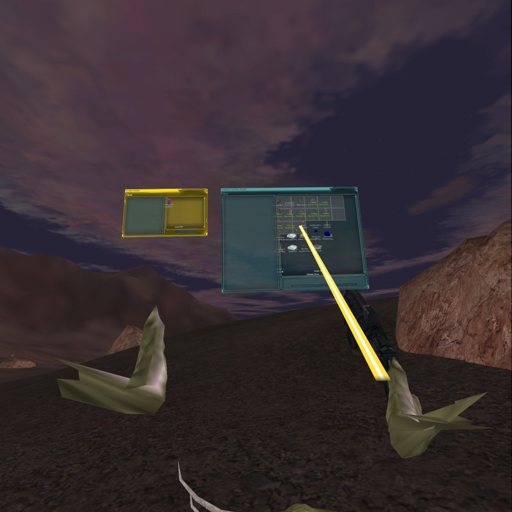

# Nikami SWG Source Lab



Clean Star Wars Galaxies client/source lab for DX11, x64, and OpenXR VR experiments.

This repository is the public Nikami working baseline for modernizing the classic SWG
client stack without mixing in private runtime assets, generated builds, or machine
local test output. It is staged like the OpenMW lab: the public branch is a clean
Nikami-authored snapshot, while upstream/source provenance is tracked outside the
published history.

## What This Is

- A source-focused SWG client/tools lab.
- A clean public baseline for OG client renderer work.
- A home for gated DX11 x64 and OpenXR VR experiments.
- A place to keep build/run/proof scripts close to the code they exercise.

## What This Is Not

- Not a packaged game client.
- Not a source of TREs, account data, server data, or proprietary runtime assets.
- Not a drop-in end-user installer.
- Not a collaboration fork with upstream write access implied by GitHub contributors.

Runtime files, client assets, build output, cleanroom folders, and local proof captures
stay outside the repository.

## Current Focus

Nikami's active SWG work is centered on the OG client VR/DX11 path:

- DX11 x64 flat mode stays the baseline that must remain healthy.
- VR stays gated behind `SWG_OG_VR` / `SWG_D3D11_VR`.
- Flat rendering must remain inert when VR flags are disabled.
- OpenXR + D3D11 plumbing is being built in proof-backed steps.
- Current VR proof work includes world-locked HUD panels, controller rays, recentering,
  hand pose capture, movement routing, and client UI interaction in headset.

## Repo Shape

```text
docs/
  OG renderer, VR bridge, and proof notes

docs/media/
  Public README screenshots and repo-facing media

scripts/dev/
  Local build, launch, cleanroom, proof, and audit helpers

src/
  SWG client/tools source tree
```

## Quick Start

This codebase is Windows-first and expects the historical SWG client toolchain.
The original project files target Visual Studio 2013-era C++ projects.

Open the main solution:

```text
src/build/win32/swg.sln
```

Useful local script entry points:

```powershell
scripts/dev/build-og-client.ps1
scripts/dev/BUILD-OG-VR-PORTABLE.ps1
scripts/dev/GET-SWG-SOURCE-CLIENT.ps1
scripts/dev/START-OG-FLAT-BINARY.ps1
scripts/dev/START-OG-VR-BINARY.ps1
scripts/dev/cleanroom/Invoke-OfficialBaseline.ps1
scripts/dev/cleanroom/Invoke-SourceOverlayBuild.ps1
```

## Renderer Rules

DX11 work follows the existing D3D9 renderer shape wherever possible. New renderer
subsystems should not grow inside `Direct3d11.cpp` unless they are temporary glue for a
module being extracted in the same change.

Current D3D11 split points include:

- `ConfigDirect3d11`
- `Direct3d11_Diagnostics`
- `Direct3d11_InputLayoutCache`
- `Direct3d11_VrBridge`

Rules for this lab:

- Keep VR behind explicit gates.
- Keep normal runtime free of diagnostic spam.
- Do not cache failed/null DirectX resources.
- Split ownership first, then change behavior in a separate proof-backed step.
- Preserve flat DX11 x64 before advancing headset behavior.

## Proof Culture

Changes should be easy to prove. The lab favors small checkpoints with concrete
captures/logs over broad renderer rewrites.

Typical proof targets:

- DX9 32-bit load-time and behavior baseline.
- DX11 32-bit visual parity baseline.
- DX11 x64 flat baseline.
- Gated OpenXR/D3D11 VR proof runs.

Detailed notes live in:

- `docs/og-vr-hud-bridge.md`
- `docs/og-vr-current-test.md`
- `docs/og-vr-modern-shadows-deep-dive.md`
- `docs/d3d11-renderer-parity-guide.md`

## Public Branch Policy

The public GitHub branch is intentionally clean and Nikami-authored, matching the
OpenMW lab publishing style. Upstream/lower source references are used for lab work,
but the public branch is published as a staged baseline rather than a full contributor
history mirror.

## License And Assets

This repository preserves the source/license context of the SWG client/tools code it is
based on. It does not grant rights to distribute Star Wars Galaxies game assets, TREs,
client data, server data, or other runtime content.

Use your own legally obtained runtime assets and keep local/generated material out of
the public source tree.
